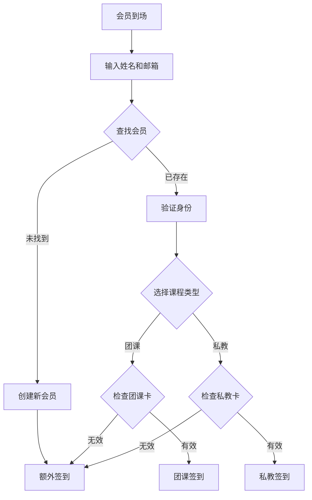

# JR泰拳馆签到系统

## 目录
1. [项目概述](#项目概述)
2. [核心功能](#核心功能)
3. [数据结构](#数据结构)
4. [业务流程](#业务流程)
5. [系统规则](#系统规则)

---

## 项目概述
JR泰拳馆签到系统是一个用于管理会员签到的 Web 应用，旨在简化会员签到流程、提升管理效率，并为管理员提供数据统计和分析功能。

### 核心目标
1. **会员签到管理**：支持新老会员签到，自动处理会员卡类型和签到规则。
2. **会员信息管理**：记录会员的基本信息、会员卡类型及状态。
3. **数据统计与分析**：为管理员提供签到记录查询和数据分析功能。

### 技术栈
- **前端**：React + TypeScript
- **后端**：Supabase（基于 PostgreSQL）
- **数据库**：PostgreSQL
- **开发工具**：Docker（用于本地开发环境）

### 环境要求
- Node.js >= 18
- npm >= 9
- Docker（用于本地开发）

---
## 核心功能
1. **签到管理**
   - 新会员签到（自动建档）
   - 老会员签到（身份验证）
   - 额外签到处理

2. **会员管理**
   - 会员信息记录
   - 会员卡状态跟踪
   - 签到记录查询

3. **数据统计**
   - 会员签到统计
   - 私教课时统计
   - 额外签到跟进

## 业务流程

### 1. 统一签到流程

### 2. 实际场景示例

#### 场景一：新会员首次签到
1. 输入姓名和邮箱
2. 系统自动创建会员档案
3. 记录额外签到
4. 工作人员跟进办卡

#### 场景二：老会员正常签到
1. 输入姓名和邮箱
2. 系统验证身份
3. 选择课程类型
4. 检查会员卡并签到

#### 场景三：老会员额外签到
1. 输入姓名和邮箱
2. 系统验证身份
3. 发现会员卡无效/课时用完/超出限制
4. 记录额外签到并提醒

## 数据统计功能
### 1. 签到统计
- 日/周/月签到人数
- 团课/私教课签到比例
- 额外签到跟踪记录

### 2. 私教课时统计
- 教练课时统计
- 1对1/1对2课程统计
---

## 数据结构

### 1. 会员信息 (members表)
- **会员ID**：唯一标识
- **会员姓名或微信名**：用于身份识别
- **联系方式（email）**：用于重名时的二次验证
- **最后签到日期**：记录最近一次签到日期

### 2. 会员卡信息 (membership_cards表)
- **id**: 卡ID
- **member_id**: 关联的会员ID
- **card_type**: 课程类型
  - 团课
  - 私教课
- **card_category**: 卡种类（仅团课适用）
  - 课时卡
  - 月卡
- **card_subtype**: 具体类型
  - 团课课时卡：单次卡、两次卡、10次卡
  - 团课月卡：单次月卡（每天最多1次）、双次月卡（每天最多2次）
  - 私教课：单次卡、10次卡
- **trainer_type**: 教练等级（仅私教课适用）
  - JR教练
  - 高级教练
- **remaining_group_sessions**: 剩余团课课时数（仅团课课时卡适用）
- **remaining_private_sessions**: 剩余私教课时数（仅私教课适用）
- **valid_until**: 有效期
  - 团课月卡：购买日起30天
  - 团课10次卡：购买日起3个月
  - 私教10次卡：购买日起1个月
  - 其他卡：无到期限制

### 3. 签到记录 (check_ins表)
- **id**: 签到ID
- **member_id**: 会员ID
- **card_id**: 使用的会员卡ID
- **course_type**: 课程类型（团课/私教）
- **class_time**: 上课时段
  - 团课：早课（9:00-10:30）或晚课（17:00-18:30）
  - 私教：按具体预约时段
- **trainer_id**: 教练ID（仅私教课适用）
- **is_1v2**: 是否1对2私教课（仅私教课适用）
- **check_in_time**: 签到时间戳
- **check_in_date**: 签到日期
- **check_in_type**: 签到类型（正常/额外）
- **notes**: 备注信息

### 4. 教练信息 (trainer表)
- **id**: 教练ID
- **name**: 教练姓名
- **type**: 教练等级
  - JR教练：
  - 高级教练：
- **notes**: 备注信息

### 5. 教练课时统计规则
- **统计数据来源**：
  - 从check_ins表筛选私教课记录
  - 关联trainer表获取教练等级
- **统计维度**：
  - 按教练统计
  - 按月份统计
  - 按课程类型（1对1/1对2）统计
- **课时费计算**：
  - 根据教练等级和课程类型自动计算
  - 支持自定义时间段统计
- **报表功能**：
  - 月度课时统计
  - 课时费用统计
  - 自定义时段统计

---

## 系统规则

### 1. 私教课程规则
- **课时规则**：
  - 单次课：无时效限制
  - 10次课：购买日起1个月内有效
- **授课方式**：
  - 支持1对1和1对2授课
  - 1对2授课需线下额外收费

### 2. 团课规则

#### 团课课时卡
- **单次卡**：1次课时，无时效限制
- **两次卡**：2次课时，无时效限制
- **10次卡**：10次课时，购买日起3个月内有效，到期未用完课时作废

#### 团课月卡
- **单次月卡**：每天最多上1次课，购买日起30天内有效
- **双次月卡**：每天最多上2次课，购买日起30天内有效
- **时段选择**：可在任一时段上课，但同一时段不可重复签到

### 3. 上课时段

#### 团课时段
- **早课**：9:00-10:30
- **晚课**：17:00-18:30
- **上课日**：周一至周六

#### 私教时段
- **工作日（周一至周五）**
  - 早课：7:00-8:00, 8:00-9:00, 10:30-11:30
  - 下午：14:00-15:00, 15:00-16:00, 16:00-17:00
  - 晚课：18:30-19:30
- **周六**
    早课：7:00-8:00, 8:00-9:00
  - 下午：14:00-15:00, 15:00-16:00, 16:00-17:00
  - 晚课：18:30-19:30

### 4. 会员卡管理
- **多卡并存规则**：
  - 会员可同时持有多张不同类型的会员卡
  - 不同类型的课程使用对应类型的会员卡
  - 系统自动匹配对应类型的有效会员卡
- **课时扣除规则**：
  - 团课课时卡：每次签到扣除1次课时
  - 团课月卡：不扣除课时，按每日次数限制
  - 私教课时卡：每次签到扣除1次课时（1对1/1对2均同）

### 5. 签到规则
- **基本规则**：
  - 身份验证：姓名/微信名+邮箱
  - 提前签到：支持当天任意时间签到
  - 重复限制：同一时段不可重复签到
- **额外签到规则**：
  - **适用情况**：
    1. 新会员首次签到
       - 系统自动创建会员档案
       - 标记为新会员额外签到
       - 提醒工作人员跟进办卡
    
    2. 老会员无有效会员卡
       - 会员卡已过期
       - 课时已用完
       - 提醒续卡或购买新卡
    
    3. 老会员超出限制
       - 月卡超出每日上课次数
       - 提醒升级双次卡或补充课时卡

  - **处理方式**：
    - 允许签到但标记为"额外签到"
    - 系统记录完整签到信息
    - 不扣除任何课时
    - 用于课程出勤统计

### 6. 教练分类
- JR类教练1名：JR
- Senior类教练：Da, Ming, Big, Bas, Sumay, First. 

---

## 界面设计

### 1. 视觉风格
- **主色调**：泰拳传统红蓝色。
- **设计风格**：蒙德里安风格，简约大气。
- **元素设计**：添加泰拳元素（如拳套 emoji），避免无意义装饰。

### 2. 交互设计
- **多语言支持**：主页中英双语对照。
- **友好提示**：清晰的错误提示和操作反馈。
- **简洁流程**：减少操作步骤，提升用户体验。

--By Hongyi Ji hongyiji224@gmail.com